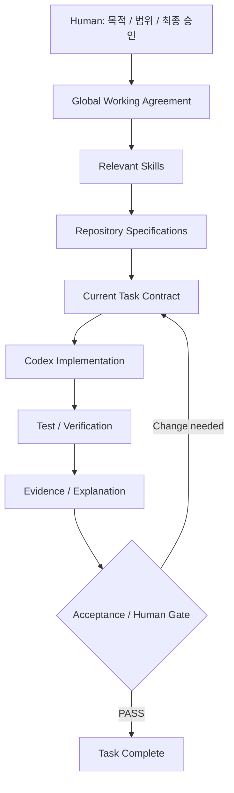

# How It Works

Codex AI Agent Playbook Kit은 하나의 거대한 Prompt가 아니라 세 층으로 나뉩니다.

```text
Global Working Agreement
        ↓
Task-specific Skills
        ↓
Repository Source of Truth
```

## 1. Global Working Agreement

`.codex/AGENTS.md`는 모든 Repository에 공통 적용할 최소 개발 원칙을 제공합니다.

주요 원칙:

- 비 trivial 작업은 Problem → Requirements → Architecture → Task → Implementation → Verification 순서로 진행
- Repository 문서를 durable Source of Truth로 사용
- 현재 Task 밖의 수정 금지
- Architecture 변경은 Human Gate
- 완료는 주장보다 Test/Evidence로 판단
- 사람이 읽을 수 있는 코드를 우선
- Hardware acceleration은 실제 실행 환경에서 검증
- 복잡한 세부 워크플로는 Skill로 분리

설치 스크립트는 전역 `AGENTS.md` 전체를 덮어쓰지 않고 marker 구간만 관리합니다.

```text
<!-- BEGIN AI_AGENT_PLAYBOOK_KIT -->
...
<!-- END AI_AGENT_PLAYBOOK_KIT -->
```

그래서 사용자가 이미 갖고 있는 다른 전역 규칙과 공존할 수 있습니다.

## 2. Skills

Skill은 특정 종류의 작업에만 필요한 세부 절차를 제공합니다.

```text
ai-agent-development-playbook
    └─ 설계 / 복잡한 개발 / Agent/RAG/Tool Contract

human-readable-code
    └─ 가독성 / 구조 / 이름 / 설명 / Readability Review

human-centered-project-builder
    └─ 프로젝트 시작부터 구현·검증·설명까지 통합

guide-ppt-creator
    └─ 기술 PPT Storyboard / Build / Render / QA

codex-long-run
    └─ 긴 실행 / Verification Budget / Checkpoint / Resume

codex-task-router
    └─ 모델 / Reasoning / topology 추천
```

모든 Skill을 한 번에 로드하지 않습니다. 현재 작업에 필요한 Skill만 사용합니다.

## 3. Repository Source of Truth

프로젝트마다 구체적인 사실은 Repository가 소유합니다.

예:

```text
PROJECT.md
REQUIREMENTS.md
ARCHITECTURE.md
DECISIONS.md
STATUS.md
tasks/TASK-001.md
```

Global Playbook은 "어떤 기술을 반드시 써라"라고 정하지 않습니다. 프로젝트별 Architecture와 기술 선택은 Repository 문서에서 관리합니다.

## 전체 개발 흐름



## 왜 Repository가 중요한가

긴 프로젝트에서는 Chat history만으로 상태를 유지하면 다음 문제가 생깁니다.

- 과거 결정과 현재 결정이 섞임
- 다른 세션에서 이어가기 어려움
- 완료된 Task와 미완료 Task 경계가 흐려짐
- 테스트 Evidence가 대화 속에 묻힘

그래서 Playbook은 중요한 프로젝트 상태를 Repository 문서와 Git 이력에 남기는 방향을 선호합니다.

## Verification의 의미

Playbook에서 완료는 다음과 다릅니다.

```text
"코드를 작성했다"
!=
"Task가 완료됐다"
```

완료에는 작업 성격에 따라 다음 Evidence가 필요할 수 있습니다.

- unit/integration/E2E test
- lint/type check
- build 결과
- command exit code
- diff review
- benchmark
- generated artifact inspection
- acceptance criteria 확인

실행하지 못한 필수 검사는 `UNVERIFIED`로 표시합니다.

## Verification Budget

매 수정마다 전체 test suite를 반복하는 것도 비효율적입니다.

기본 패턴은:

```text
coherent change
→ focused verification
→ 다음 coherent change
→ focused verification
→ final regression / acceptance verification
```

`codex-long-run`은 이런 긴 작업의 Verification Budget과 resume를 담당합니다.

## codex-task-router의 위치

Router는 설계보다 먼저 사용하지 않습니다.

```text
Problem / Requirements / Architecture / Work Unit
                    ↓
             codex-task-router
                    ↓
      minimum sufficient capability
```

작업이 충분히 정의되지 않았다면 더 강한 모델을 고르는 것이 해결책이 아니므로 `INVESTIGATE FIRST`를 반환하도록 설계되어 있습니다.

## Human Gate

다음과 같은 문제는 Codex가 조용히 결정하지 않습니다.

- 중요한 Architecture 변경
- 요구사항 충돌
- major dependency 교체
- 보안/권한 영향
- irreversible data risk
- production migration
- material public API change
- 큰 비용/운영 영향

반대로, 승인된 Architecture 안의 작은 구현 선택은 불필요하게 매번 묻지 않고 진행할 수 있습니다.

## 핵심 철학

Playbook의 목적은 AI에게 절차를 많이 강요하는 것이 아닙니다.

```text
정확성
+ 이해 가능성
+ 검증 가능성
+ 재개 가능성
- 불필요한 복잡성
```

현재 작업을 신뢰성 있게 끝내는 데 필요한 최소 구조를 사용합니다.
