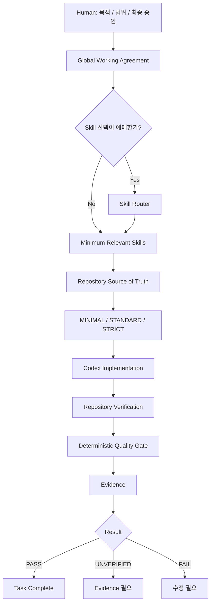

# 동작 원리 - V8

Codex AI Agent Playbook V8은 하나의 거대한 Prompt가 아니라 여러 층을 분리해 사용합니다.

```text
Global Working Agreement
        ↓
필요 시 Skill Router
        ↓
Task-specific Skills
        ↓
Repository Source of Truth
        ↓
Risk-based Verification Profile
        ↓
Quality Gate / Evidence
```

핵심 목적은 **항상 읽는 Context를 줄이면서도 검증 신뢰성은 유지하거나 높이는 것**입니다.

## 1. Global Working Agreement

`.codex/AGENTS.md`는 모든 Repository에 공통 적용할 최소 원칙만 제공합니다.

주요 원칙:

- Repository 문서를 durable Source of Truth로 사용
- 현재 Task 밖의 수정 최소화
- Architecture/요구사항/보안 경계 변경은 Human Gate
- 완료는 주장보다 Test/Evidence로 판단
- 필요한 Skill만 로드
- Context는 제한된 자원으로 취급
- 단순 작업에 과한 절차를 사용하지 않음

설치 스크립트는 전역 `AGENTS.md` 전체를 덮어쓰지 않고 marker 구간만 관리합니다.

```text
<!-- BEGIN AI_AGENT_PLAYBOOK_KIT -->
...
<!-- END AI_AGENT_PLAYBOOK_KIT -->
```

그래서 사용자가 marker 밖에 직접 작성한 다른 전역 규칙과 공존할 수 있습니다.

## 2. Context-aware Skill Router

V8에는 `codex-skill-router`가 추가되었습니다.

이 Router는 모든 작업에서 실행하지 않습니다.

```text
명확한 작은 작업
-> 바로 필요한 Skill 또는 Skill 없음

애매한 비단순 작업
-> codex-skill-router
-> 최소 Skill 집합 + 검증 Profile 추천
```

Router가 판단하는 항목:

- 최소 Skill 집합
- MINIMAL / STANDARD / STRICT
- long-run 필요 여부
- capability router 필요 여부
- Human Gate 필요 여부

Router 자체가 구현을 대신하지는 않습니다.

## 3. Skills

V8의 managed Skill은 7개입니다.

```text
codex-skill-router
    └─ 최소 Skill/Profile 추천

ai-agent-development-playbook
    └─ 설계 / 복잡한 개발 / Agent/RAG/Tool Contract

human-readable-code
    └─ 가독성 / 구조 / 설명 / Readability Review

human-centered-project-builder
    └─ 프로젝트 시작부터 구현·검증까지 통합

guide-ppt-creator
    └─ 기술 PPT Storyboard / Build / Render / QA

codex-long-run
    └─ 긴 실행 / Verification Budget / Checkpoint / Resume

codex-task-router
    └─ 모델 / Reasoning / topology 추천
```

모든 Skill을 한 번에 로드하지 않습니다.

## 4. Repository Source of Truth

프로젝트별 사실은 Repository가 소유합니다.

예:

```text
PROJECT.md
REQUIREMENTS.md
ARCHITECTURE.md
DECISIONS.md
STATUS.md
tasks/TASK-001.md
```

Global Playbook은 특정 기술 stack이나 모델을 영구적으로 강제하지 않습니다.
프로젝트별 Architecture, acceptance criteria, 테스트 명령은 Repository 문서가 우선합니다.

## 5. Risk-based Verification Profile

작업마다 같은 검증 비용을 쓰지 않습니다.

### MINIMAL

- 작은 isolated edit
- 낮은 위험
- 쉬운 검증

### STANDARD

- 일반적인 비단순 개발
- diff + 관련 테스트 + acceptance 확인이 필요한 작업

### STRICT

- 보안/권한
- 배포/마이그레이션
- 파괴적 변경
- 중요한 Architecture/Public Contract 변경
- 실패 비용이 큰 작업

강한 모델을 선택하는 것과 검증 Profile은 별개입니다.

## 6. 전체 흐름



## 7. Quality Gate

V8 Quality Gate는 LLM의 자기 평가가 아니라 Python 코드로 수행합니다.

```cmd
python "%USERPROFILE%\.codex\playbook-harness\quality\quality_gate.py" --repo . --profile standard
```

검사 예:

- unstaged/staged `git diff --check`
- unresolved conflict
- conflict marker
- changed/untracked file 수
- STANDARD/STRICT suspicious-secret scan
- 전달된 verification command 실행 결과

STRICT에서 필요한 실행 Evidence가 없다면:

```text
RESULT     UNVERIFIED
```

으로 끝납니다.

즉:

```text
Agent가 자신있다고 말함
!= Evidence

실제 command / diff / test / artifact
= Evidence
```

## 8. Harness Audit

Playbook 자체도 검사합니다.

```cmd
python harness\security\harness_audit.py --root .
```

검사 범위:

- Global AGENTS 크기 예산
- marker integrity
- Skill metadata/중복
- Skill 검색 경로 내부 backup
- profile JSON
- Harness Python syntax
- MANIFEST coverage
- 명백한 secret/개인 경로 패턴

V8 Windows 검증에서는 `warnings: 0`, `RESULT PASS`를 확인했습니다.

## 9. Verification Budget

매 수정마다 전체 test suite를 반복하는 것도 비효율적입니다.

기본 패턴:

```text
coherent change
-> focused verification
-> 다음 coherent change
-> focused verification
-> final regression / acceptance verification
```

`codex-long-run`은 이런 긴 작업의 Context, Verification Budget, checkpoint/resume를 담당합니다.

## 10. Human Gate

다음은 Codex가 조용히 결정하지 않습니다.

- 중요한 Architecture 변경
- 요구사항 충돌
- major dependency 교체
- 보안/권한 영향
- irreversible data risk
- production migration
- material public API change
- 큰 비용/운영 영향

반대로 승인된 Architecture 안의 작은 구현 선택은 불필요하게 매번 묻지 않고 진행할 수 있습니다.

## 핵심 철학

```text
정확성
+ 적은 고정 Context
+ 필요한 Skill만 선택
+ 위험도에 맞는 검증
+ 재개 가능성
+ 실제 Evidence
- 불필요한 복잡성
```

V8은 더 많은 Agent 계층을 만드는 것보다 **Codex가 현재 작업을 신뢰성 있게 끝내는 데 필요한 최소 Harness**를 목표로 합니다.
