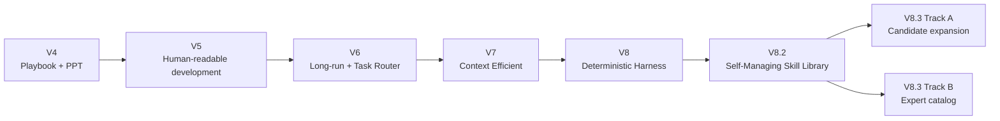

# Codex AI Agent Playbook — 프로젝트 기록

> 개발 과정에서 **무엇을 만들었는지**뿐 아니라 **왜 그렇게 바꿨는지, 어디서 실패했는지, 무엇을 검증했는지**를 남기는 기록입니다.

이 디렉터리는 사용자 가이드(`docs/QUICKSTART.md`, `docs/HOW_IT_WORKS.md`)와 목적이 다릅니다.  
사용자 가이드는 현재 사용법을 설명하고, 이 기록은 프로젝트가 현재 구조에 도달한 **과정과 Evidence**를 보존합니다.

## 기록 문서

| 문서 | 내용 |
|---|---|
| [DEVELOPMENT_JOURNAL.md](DEVELOPMENT_JOURNAL.md) | V4 → V8.3 개발 흐름, 설계 변화, 주요 체크포인트 |
| [TROUBLESHOOTING_LOG.md](TROUBLESHOOTING_LOG.md) | 실제 장애/실수/실패의 증상 → 원인 → 조치 → 재발 방지 |
| [RESEARCH_LOG.md](RESEARCH_LOG.md) | Skill Library 확장 연구, 외부 소스 조사, BENCH 실험 기록 |

## 현재 기준점 — 2026-08-23

안정 버전은 `main`의 **V8.2**입니다.  
V8.3은 Skill Library를 대규모로 확장하기 위한 실험/검증 단계입니다.

```text
main
└─ V8.2 COMPLETE - VERIFIED

v8.3-skill-library-expansion
└─ Track A: 내부 Candidate 확장 / promotion 전 검증

v8.3-expert-skill-catalog
└─ Track B: 외부 Expert Skill catalog / inspection / benchmark
```

### V8.3 Track B 원격 체크포인트

```text
8c5fc7d8818bf9bdc0b972386d640ded04e9d1e9
V8.3: complete expert skill inspection verification

↓

d8e801f2b668027baafb51f3fbf73507e9e659fe
V8.3: define 50+ expert skill inspection expansion
```

### 2026-08-23 로컬 작업 체크포인트

아래 값은 이 문서 작성 시점의 **로컬 실행 Evidence**이며 아직 `v8.3-expert-skill-catalog` 원격 HEAD에는 커밋되지 않은 상태입니다.

```text
INSPECTED                53
BENCHMARK_READY          43
ECC path-drift REJECTED   4
external scripts executed 0
focused inspection tests  8/8 PASS
git diff --check          PASS
working tree              evaluation/external-skills/inspections.json modified
```

원격 기록과 로컬 Evidence를 의도적으로 구분합니다. 완료 판정은 항상 실제 Git/Test/Artifact Evidence를 기준으로 합니다.

## 기록 원칙

이 프로젝트의 개발 기록은 다음 원칙을 따릅니다.

1. **자기보고 PASS를 Evidence로 사용하지 않는다.**
2. Git 상태, 테스트 결과, Quality Gate, Audit, 실제 파일 내용을 우선한다.
3. 실패를 삭제하지 않고 원인과 재발 방지까지 기록한다.
4. 외부 Skill은 이름이나 README만 믿지 않고 pinned revision의 실제 path/content/license를 확인한다.
5. 외부 script/install은 inspection 중 실행하지 않는다.
6. 라이선스 불명확/Proprietary는 자동 채택하지 않는다.
7. Task 범위를 넓혀서 테스트를 통과시키지 않는다.
8. 토큰 절감은 중요하지만 정확성/검증 강도보다 우선하지 않는다.

## 전체 흐름



## 관련 Source of Truth

- `README.md`, `README_KO.md`
- `docs/DEVELOPMENT.md`
- `V4_CHANGES_KO.md` ~ `V7_CHANGES_KO.md`
- `V8_1_ARCHITECTURE.md`
- `tasks/`
- `evaluation/external-skills/`
- `harness/`
- `.codex/AGENTS.md`
- `.agents/skills/`

이 기록은 위 파일들을 대체하지 않습니다. **현재 동작과 계약은 Repository Source of Truth가 우선**이며, 이 디렉터리는 그 결정이 만들어진 배경을 설명합니다.
