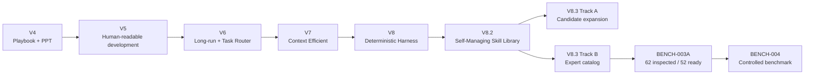

# Codex AI Agent Playbook — 프로젝트 기록

> 개발 과정에서 **무엇을 만들었는지**뿐 아니라 **왜 그렇게 바꿨는지, 어디서 실패했는지, 무엇을 검증했는지**를 남기는 기록입니다.

이 디렉터리는 사용자 가이드(`docs/QUICKSTART.md`, `docs/HOW_IT_WORKS.md`)와 목적이 다릅니다. 사용자 가이드는 현재 사용법을 설명하고, 이 기록은 프로젝트가 현재 구조에 도달한 **과정과 Evidence**를 보존합니다.

## 기록 문서

| 문서 | 내용 |
|---|---|
| [LATEST_STATUS.md](LATEST_STATUS.md) | 현재 V8.3 체크포인트와 다음 단계 |
| [DEVELOPMENT_JOURNAL.md](DEVELOPMENT_JOURNAL.md) | V4 → V8.3 개발 흐름, 설계 변화, 주요 체크포인트 |
| [TROUBLESHOOTING_LOG.md](TROUBLESHOOTING_LOG.md) | 실제 장애/실수/실패의 증상 → 원인 → 조치 → 재발 방지 |
| [RESEARCH_LOG.md](RESEARCH_LOG.md) | Skill Library 확장 연구, 외부 소스 조사, BENCH 실험 기록 |

문서 작성 원칙은 [`docs/DOCUMENTATION_POLICY.md`](../DOCUMENTATION_POLICY.md)를 따릅니다.

---

## 현재 기준점 — 2026-08-24

안정 버전은 `main`의 **V8.2 COMPLETE - VERIFIED**입니다.

V8.3은 Skill Library를 대규모로 확장하기 위한 개발/검증 단계입니다.

```text
main
└─ V8.2 COMPLETE - VERIFIED

v8.3-skill-library-expansion
└─ Track A: 내부 Candidate 확장 / promotion 전 검증

v8.3-expert-skill-catalog
└─ Track B: 외부 Expert Skill catalog / inspection / benchmark
```

### Track A

체크포인트:

```text
e5a83cdf78a091f68978f46138f402e866bce278
V8.3: register Batch 2A candidate files in manifest
```

Evidence:

```text
Candidate                8/8
activation regression   72/72
Skill Audit               9/9
skills                   79/79
Harness Audit            PASS
STRICT Gate              PASS / exit 0
```

아직 ACTIVE promotion은 하지 않았습니다.

### Track B — BENCH-003A COMPLETE - VERIFIED

이전 BENCH-003 완료 commit:

```text
8c5fc7d8818bf9bdc0b972386d640ded04e9d1e9
V8.3: complete expert skill inspection verification
```

BENCH-003A Task baseline:

```text
d8e801f2b668027baafb51f3fbf73507e9e659fe
V8.3: define 50+ expert skill inspection expansion
```

BENCH-003A 완료 commit:

```text
4e1d92531cebb32a995562e922db50b35e0bcb5f
V8.3: expand expert skill inspection to 50+ ready candidates
```

GitHub 원격 `v8.3-expert-skill-catalog` HEAD도 위 완료 SHA와 동일함을 확인했습니다.

최종 Evidence:

```text
INSPECTED                  62
BENCHMARK_READY            52
INSPECTION_DOMAINS         20
INSPECTION_SOURCES          5
SHORTLIST                  15
ACTIVE_IMPORTS              0
ACTIVE_REGISTRY_UNCHANGED  True
EXTERNAL_SCRIPTS_EXECUTED   0
```

검증:

```text
External Catalog          12/12 PASS
Effective Coverage         5/5 PASS
Candidate Wave             5/5 PASS
Inspection Wave            8/8 PASS
V8.2 normal regression    72/72 PASS
Harness Audit             PASS / warnings 0
STRICT Quality Gate       PASS
git diff --check          PASS
working tree              CLEAN before push
```

따라서 BENCH-003A는 **COMPLETE - VERIFIED**로 기록합니다.

---

## BENCH-003A에서 새로 남긴 기록

### ECC path drift

다음 기존 후보는 pinned revision에서 실제 path가 없어 `REJECTED` 처리했습니다.

```text
ecc-aws
ecc-azure-bicep
ecc-api-security
ecc-arm-cortex-m
```

실제 ECC 트리에서 별도 후보로 확인한 Skill은 향후 catalog-correction Task로 분리합니다.

### K-Dense 추가 inspection

저장소 rename을 다음으로 확인했습니다.

```text
K-Dense-AI/scientific-agent-skills
```

추가 8개 후보를 정적검사해 `BENCHMARK_READY` pool에 반영했습니다.

### `anth-claude-api`

기존 100 Candidate 중 `anth-claude-api`를 정적 검사해 `backend-api` domain coverage를 채웠습니다.

### 테스트 fixture 수정

특정 candidate ID를 미검사 상태로 하드코딩하던 테스트를 invariant 기반 fixture로 수정했습니다. Validator 자체는 약화하지 않았습니다.

### LF → CRLF

Windows Git 경고가 STRICT Gate의 conflict 검사에 잡혀 한 차례 FAIL했지만 실제 conflict는 아니었습니다. CRLF를 복구한 뒤 focused test와 STRICT Gate를 모두 재통과했습니다.

---

## README 최신화

GitHub 첫 화면과 상세 한글 가이드를 BENCH-003A 완료 상태에 맞춰 갱신했습니다.

```text
README.md
README_KO.md
```

두 문서 모두 다음을 구분합니다.

```text
안정판  V8.2 COMPLETE / VERIFIED
개발판  V8.3 Skill Library Expansion
```

설치와 일반 사용 명령은 검증된 `main` 기준으로 유지하고, V8.3 Track A/Track B 개발 현황은 별도로 표시합니다.

---

## 기록 원칙

1. **자기보고 PASS를 Evidence로 사용하지 않는다.**
2. Git 상태, 테스트 결과, Quality Gate, Audit, 실제 파일 내용을 우선한다.
3. 실패를 삭제하지 않고 원인과 재발 방지까지 기록한다.
4. 외부 Skill은 이름이나 README만 믿지 않고 pinned revision의 실제 path/content/license를 확인한다.
5. 외부 script/install/API는 inspection 중 실행하지 않는다.
6. 라이선스 불명확/Proprietary는 자동 채택하지 않는다.
7. Task 범위를 넓혀서 테스트를 통과시키지 않는다.
8. 토큰 절감은 중요하지만 정확성/검증 강도보다 우선하지 않는다.
9. 설명 문서는 한국어를 기본으로 작성하고 실제 계약 식별자만 원문을 유지한다.

---

## 전체 흐름



---

## 다음 단계

Track B 다음 단계:

```text
BENCH-003A COMPLETE - VERIFIED
→ BENCH-004 controlled benchmark
→ ADOPT / ADAPT / REFERENCE / REJECT 판단
→ 충분한 Evidence가 있는 일부만 promotion 후보
```

별도로 ECC 실존 후보를 catalog에 새로 등록하는 correction Task를 분리합니다.

---

## 관련 Source of Truth

- `README.md`, `README_KO.md`
- `docs/DEVELOPMENT.md`
- `docs/DOCUMENTATION_POLICY.md`
- `V4_CHANGES_KO.md` ~ `V7_CHANGES_KO.md`
- `V8_1_ARCHITECTURE.md`
- `tasks/`
- `evaluation/external-skills/`
- `harness/`
- `.codex/AGENTS.md`
- `.agents/skills/`

이 기록은 위 파일들을 대체하지 않습니다. **현재 동작과 계약은 Repository Source of Truth가 우선**이며, 이 디렉터리는 그 결정이 만들어진 배경을 설명합니다.